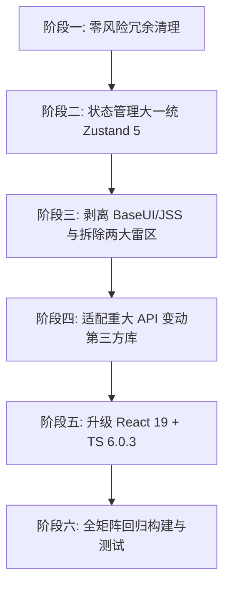

# NextAI Translator 核心技术栈现代化大重构执行规范

> **说明**：本技术规范旨在指导下一阶段的技术大重构。通过淘汰历史包袱（BaseUI、Styletron、React-JSS、过时垫片、雷区旧组件等）、收敛状态与样式体系、并全面升级至 **React 19 + TypeScript 6.0 + Zustand 5**，实现代码库的轻量化与现代化。

---

## 目录
1. [重构目标与原则](#一重构目标与原则)
2. [依赖清洗清单 (Add / Remove / Upgrade)](#二依赖清洗清单)
3. [分阶段实施路线图 (Phase 1 ~ Phase 6)](#三分阶段实施路线图)
4. [核心模块重构细则与代码对照](#四核心模块重构细则与代码对照)
   - [4.1 移除无用与过时工具库](#41-移除无用与过时工具库)
   - [4.2 统一状态管理 (收敛至 Zustand 5)](#42-统一状态管理-收敛至-zustand-5)
   - [4.3 彻底剥离 BaseUI + Styletron + React-JSS](#43-彻底剥离-baseui--styletron--react-jss)
   - [4.4 浏览器插件 Shadow DOM 样式精简化](#44-浏览器插件-shadow-dom-样式精简化)
   - [4.5 拆除雷区 1：彻底淘汰 `react-draggable` (改用现代原生 Pointer Drag)](#45-拆除雷区-1彻底淘汰-react-draggable-改用现代原生-pointer-drag)
   - [4.6 拆除雷区 2：彻底淘汰 `rc-field-form` (表单现代化改造)](#46-拆除雷区-2彻底淘汰-rc-field-form-表单现代化改造)
   - [4.7 适配 Tesseract.js 7.x](#47-适配-tesseractjs-7x)
   - [4.8 适配 React-Markdown 10.x & Remark-GFM 4.x](#48-适配-react-markdown-10x--remark-gfm-4x)
   - [4.9 适配 React-Window 2.x](#49-适配-react-window-2x)
   - [4.10 升级 React 19 与 TypeScript 6.0.3](#410-升级-react-19-与-typescript-603)
5. [验收标准与回归测试矩阵](#五验收标准与回归测试矩阵)

---

## 一、重构目标与原则

### 1. 核心目标
1. **脱去枷锁**：彻底剔除 Uber BaseUI (`baseui`) 及其绑定的 Styletron、React-JSS、本地补丁 `patches/baseui@18.2.0.patch` 和过时的 `eslint-plugin-baseui`。
2. **直升现代主版本**：升级到 **React 19** (`^19.2.8`) 与 **TypeScript 6.0** (`~6.0.3`)，保持 `@types/node` 于 `24.*` (`^24.13.3`)。
3. **收敛技术栈**：
   - **样式系统**：统一为现代轻量方案（Tailwind CSS / 统一 CSS Modules + Radix UI Primitives），终结 4 种样式体系（Styletron + JSS + CSS Modules + Inline Style）并存的混乱局面。
   - **状态系统**：彻底移除 `react-hooks-global-state` 与 `jotai`，统一全域状态至 `zustand@5`。
4. **排除潜在雷区组件**：
   - **`react-draggable`**：其类组件与 `findDOMNode` 机制在 React 19 下为致命崩溃点，且对 Shadow DOM 的 `bounds` 极其不友好，必须使用现代原生 Pointer Drag 彻底替换。
   - **`rc-field-form`**：Ant Design 4 时代的遗留表单库，深度绑定 BaseUI，全工程仅一处使用，升级至 `react-hook-form` 或轻量受控表单。
5. **清理历史沉疴**：移除 `underscore`、`react-copy-to-clipboard`、`web-streams-polyfill`、`common-tags`、`lodash.debounce`。

### 2. 重构原则
- **渐进式实施**：按模块、按风险分阶段提交，确保每个阶段均可通过自动化测试与构建，严禁“一刀切断崖式修改”。
- **跨平台一致性**：同时保持 Chrome 插件、Firefox 插件、Tauri 桌面端、Userscript 四个 target 的功能与 UI 表现一致。

---

## 二、依赖清洗清单

### 1. 彻底移除 (Remove)
| 包名 | 移除原因 | 替代方案 |
| :--- | :--- | :--- |
| `baseui` | 官方停更，锁死 React 19，Shadow DOM 严重冲突 | 现代轻量原子组件 (Radix UI / Tailwind / 纯 CSS) |
| `styletron-engine-atomic` | BaseUI 绑定的运行时 CSS-in-JS | 原生 CSS / Tailwind CSS |
| `styletron-react` | BaseUI 绑定的运行时 CSS-in-JS | 原生 CSS / Tailwind CSS |
| `jss` & `jss-preset-default` | 官方生态事实弃用，并发模式兼容差 | 原生 CSS / Tailwind CSS / CSS Modules |
| `react-jss` | 官方生态事实弃用，无法支持 React 19 | 原生 CSS / Tailwind CSS / CSS Modules |
| `eslint-plugin-baseui` | 停更于 2023，使用已废弃 ESLint 8 API | 移除（不再需要 BaseUI 规则检查） |
| **`react-draggable`** | **【重大雷区】** 依赖已彻底废弃的 `findDOMNode`，React 19 必崩；Shadow DOM 兼容性极差 | 现代 30 行原生 `PointerEvent` 拖拽 Hook |
| **`rc-field-form`** | **【潜在雷区】** AntD 4 遗留引擎，深层子路径破坏，全工程仅用于 ActionForm | `react-hook-form` 或标准受控表单 |
| `react-hooks-global-state` | 上古试验库，严重冗余 | 统一并入 `zustand` |
| `jotai` | 状态管理冗余，仅用于一个 atom | 统一并入 `zustand` |
| `underscore` | 仅调用了 `isEqual` 和 `debounce`，体积大 | 原生 ES6+ / `use-deep-compare` / 自定义 hook |
| `react-copy-to-clipboard` | 底层依赖已废弃的 `execCommand` | 原生 `navigator.clipboard.writeText` |
| `@types/react-copy-to-clipboard` | 配套类型库 | 移除 |
| `web-streams-polyfill` | 现代浏览器与 Node 24 原生支持，且造成 TS 6.0 报错 | 原生 `window.ReadableStream` |
| `common-tags` & `@types/common-tags` | 2018 年老旧文本模板库 | 原生模板字符串或微型 helper |
| `lodash.debounce` & `@types/lodash.debounce` | 弃用的单函数包 | 自定义 `useDebounce` hook |
| `@types/color` | `color@5` 已自带 TS 类型 | 移除 |
| `@types/react-window` | npm 官方标注 `[DEPRECATED]`，v2 自带类型 | 移除 |

### 2. 升级并适配 (Upgrade & Adapt)
| 包名 | 原版本 | 目标版本 | 适配重点 |
| :--- | :--- | :--- | :--- |
| `typescript` | `^5.9.3` | **`~6.0.3`** | 适配 DOM Lib `[Symbol.asyncDispose]` 等严格类型推断 |
| `react` | `^18.3.1` | **`^19.2.8`** | BaseUI 与 react-draggable 剥离后顺畅升级 |
| `react-dom` | `^18.3.1` | **`^19.2.8`** | 移除 `react-dom/test-utils` 改为 `react` 导出 `act` |
| `@types/react` | `^18.3.31` | **`^19.2.18`** | 对齐 React 19 |
| `@types/react-dom` | `^18.3.7` | **`^19.2.7`** | 对齐 React 19 |
| `zustand` | `^4.5.7` | **`^5.0.15`** | 收敛全部全局状态 |
| `tesseract.js` | `^4.1.4` | **`^7.0.0`** | 改写 `createWorker` 初始化流程（移除 `loadLanguage/initialize`） |
| `react-markdown` | `^8.0.7` | **`^10.1.0`** | 移除 `code` 的 `inline` 参数与 `th` 的 `isHeader` 参数 |
| `remark-gfm` | `^3.0.1` | **`^4.0.1`** | 配合 React-Markdown 10 |
| `react-window` | `^1.8.11` | **`^2.3.1`** | 适配 v2 functional 规范，内置类型 |
| `date-fns` | `^2.30.0` | **`^4.4.0`** | 纯 ESM，提升打包树摇效率 |
| `color` | `^4.2.3` | **`^5.0.3`** | 纯 ESM，原生内置类型 |
| `uuid` | `^13.0.2` | **`^14.0.2`** | 现代 Node/Browser 目标 |
| `dexie` | `^3.2.7` | **`^4.4.5`** | 原生 Promise 架构升级 |
| `dexie-react-hooks` | `^1.1.7` | **`^4.4.0`** | 适配 Dexie 4 |
| `react-dropzone` | `^14.4.1` | **`^20.1.1`** | 支持 React 19 |
| `react-error-boundary` | `^4.1.2` | **`^6.1.5`** | 支持 React 19 |
| `react-hotkeys-hook` | `^4.6.2` | **`^5.3.3`** | 支持 React 19 |
| `hotkeys-js` | `^3.13.15` | **`^4.0.7`** | 纯现代模块化 |
| `katex` | `^0.16.47` | **`^0.18.6`** | 保持样式库最新 |
| `vitest` | `^4.1.11` | **`^5.0.0`** | 现代测试运行器，支持 Vite 8 |
| `jsdom` | `^26.1.0` | **`^30.0.1`** | 升级测试 DOM 模拟环境 |
| `eslint-plugin-react-hooks` | `^5.2.0` | **`^7.1.1`** | 支持 React 19 规则检查 |

---

## 三、分阶段实施路线图



### 阶段一：零风险冗余清理 (Phase 1)
1. 用 `navigator.clipboard.writeText` 替换 `react-copy-to-clipboard`。
2. 用原生语法或轻量实现替换 `underscore` 中的 `_.isEqual` 与 `_.debounce`。
3. 移除 `common-tags`，改写 Prompt 模板生成逻辑。
4. 移除 `web-streams-polyfill`，全量换回浏览器原生 `window.ReadableStream`。
5. 卸载：`underscore`, `react-copy-to-clipboard`, `@types/react-copy-to-clipboard`, `common-tags`, `@types/common-tags`, `web-streams-polyfill`。
6. **验证**：`pnpm test && pnpm lint`。

### 阶段二：状态管理大一统 (Phase 2)
1. 升级 `zustand` 至 `^5.0.15`。
2. 将 [`src/common/hooks/global.ts`](file:///d:/Develop/Projects/nextai-translator/src/common/hooks/global.ts)（`collectedWordTotal`, `themeType`, `pinned`）整合进主 Store。
3. 将 [`src/common/store/setting.ts`](file:///d:/Develop/Projects/nextai-translator/src/common/store/setting.ts)（`showSettingsAtom`）整合进主 Store。
4. 卸载：`react-hooks-global-state`、`jotai`。
5. **验证**：检查浮窗 Pin、词汇计数、主题切换功能是否正常。

### 阶段三：UI 样式替换与拆除两大雷区组件 (Phase 3 - 核心战场)
1. **拆除雷区 1（`react-draggable`）**：编写基于标准 `PointerEvent` 的轻量 `useDraggable` Hook，替换 [`InnerContainer.tsx`](file:///d:/Develop/Projects/nextai-translator/src/browser-extension/content_script/InnerContainer.tsx) 中的拖拽逻辑，彻底告别 Shadow DOM 边界错误与 `findDOMNode`。卸载 `react-draggable`。
2. **拆除雷区 2（`rc-field-form`）**：改造 [`ActionForm.tsx`](file:///d:/Develop/Projects/nextai-translator/src/common/components/ActionForm.tsx)，移除旧版 `Form/form.ts` 和 `item.tsx`，换用轻量受控表单或 `react-hook-form`。卸载 `rc-field-form`。
3. 建立基础轻量 UI 组件库（替代 BaseUI 的 Button, Input, Select, Tooltip, Modal 等）。
4. 替换全工程 76 处 BaseUI 引用与 33 处 JSS 引用。
5. 清理 `src/browser-extension/content_script/index.tsx` 和 `src/tauri/components/Window.tsx`：
   - 彻底删除 `StyletronProvider`、`BaseProvider`、`JssProvider`。
6. 删除 `patches/baseui@18.2.0.patch`，从 `package.json` 和 `eslint.config.mjs` 中移除 `eslint-plugin-baseui`。
7. **验证**：`pnpm test && pnpm dev-chromium && pnpm dev-tauri`。

### 阶段四：第三方库重大 API 适配 (Phase 4)
1. 升级并改写 `tesseract.js@7.0.0`：更新 `createWorker` 初始化流程。
2. 升级并改写 `react-markdown@10.1.0` 与 `remark-gfm@4.0.1`：重构 `Markdown.tsx`。
3. 升级 `react-window@2.3.1`，卸载 `@types/react-window`，适配 `IconPicker.tsx`。
4. 升级 `date-fns@4.4.0`、`color@5.0.3`（卸载 `@types/color`）、`uuid@14.0.2`、`dexie@4.4.5`、`dexie-react-hooks@4.4.0`。
5. **验证**：测试 OCR 图像翻译、Markdown 渲染、虚拟滚动图标列表、IndexedDB 历史保存。

### 阶段五：升级 React 19 与 TypeScript 6.0 (Phase 5)
1. 更新 `package.json`：
   ```json
   "react": "^19.2.8",
   "react-dom": "^19.2.8",
   "@types/react": "^19.2.18",
   "@types/react-dom": "^19.2.7",
   "typescript": "~6.0.3",
   "eslint-plugin-react-hooks": "^7.1.1",
   "vitest": "^5.0.0",
   "jsdom": "^30.0.1"
   ```
2. 修复 `src/common/components/model-option-filter.spec.tsx`：将 `import { act } from 'react-dom/test-utils'` 更改为 `import { act } from 'react'`。
3. 执行 `pnpm install`。
4. 运行 `tsc --noEmit`、`pnpm lint`、`pnpm test` 并修复新类型定义微调。

### 阶段六：全平台回归与构建打包验收 (Phase 6)
- 运行 `pnpm clean`。
- 构建 Chrome 插件：`pnpm build-chrome`。
- 构建桌面端渲染层：`pnpm build-tauri-renderer`。
- 构建脚本：`pnpm build-userscript-local`。
- 自动化端到端测试：`pnpm test:e2e`。

---

## 四、核心模块重构细则与代码对照

### 4.1 移除无用与过时工具库

#### 剪贴板复制 (`CopyButton.tsx`)
```typescript
// 🔴 重构前 (使用 react-copy-to-clipboard)
import { CopyToClipboard } from 'react-copy-to-clipboard'
<CopyToClipboard text={text} onCopy={() => toast(t('Copy to clipboard'))}>
    <div className={styles.actionButton}><RxCopy size={13} /></div>
</CopyToClipboard>

// 🟢 重构后 (原生 API)
<div
    className={styles.actionButton}
    onClick={async () => {
        await navigator.clipboard.writeText(text)
        toast(t('Copy to clipboard'), { duration: 3000, icon: '👏' })
    }}
>
    <RxCopy size={13} />
</div>
```

#### 移除 `underscore`
- `_.isEqual(a, b)` $\rightarrow$ 直接使用已有的 `use-deep-compare` 中的 `dequal` 或实现轻量比较。
- `_.debounce(fn, ms)` $\rightarrow$ 替换为本地 5 行轻量实现的 `debounce` 函数。

#### 移除 `web-streams-polyfill` ([`src/common/background/fetch.ts`](file:///d:/Develop/Projects/nextai-translator/src/common/background/fetch.ts#L42))
```typescript
// 🔴 重构前
const ReadableStream = isFirefox()
    ? (ReadableStreamPolyfill as typeof window.ReadableStream)
    : window.ReadableStream

// 🟢 重构后 (现代环境均有原生 ReadableStream)
const ReadableStream = window.ReadableStream
```

---

### 4.2 统一状态管理 (收敛至 Zustand 5)

将原本散落在 `react-hooks-global-state`、`jotai` 和 `store.ts` 的状态收敛合并至 [`src/common/store.ts`](file:///d:/Develop/Projects/nextai-translator/src/common/store.ts)：

```typescript
// 🟢 新版 src/common/store.ts
import { create } from 'zustand'
import { ThemeType } from './types'

interface IAppState {
    // 原 zustand 字段
    externalOriginalText?: string
    translatedText?: string
    isTranslating?: boolean
    // 原 react-hooks-global-state 字段
    collectedWordTotal: number
    themeType: ThemeType
    pinned: boolean
    // 原 jotai 字段
    showSettings: boolean

    // Actions
    setExternalOriginalText: (text: string) => void
    setStoreTranslatedText: (text: string) => void
    setStoreIsTranslating: (val: boolean) => void
    setCollectedWordTotal: (total: number) => void
    setThemeType: (theme: ThemeType) => void
    setPinned: (pinned: boolean) => void
    setShowSettings: (show: boolean | ((prev: boolean) => boolean)) => void
}

export const useAppStore = create<IAppState>()((set) => ({
    externalOriginalText: undefined,
    translatedText: undefined,
    isTranslating: undefined,
    collectedWordTotal: 0,
    themeType: 'light',
    pinned: false,
    showSettings: false,

    setExternalOriginalText: (text) => set({ externalOriginalText: text }),
    setStoreTranslatedText: (text) => set({ translatedText: text }),
    setStoreIsTranslating: (isTranslating) => set({ isTranslating }),
    setCollectedWordTotal: (collectedWordTotal) => set({ collectedWordTotal }),
    setThemeType: (themeType) => set({ themeType }),
    setPinned: (pinned) => set({ pinned }),
    setShowSettings: (updater) =>
        set((state) => ({
            showSettings: typeof updater === 'function' ? updater(state.showSettings) : updater,
        })),
}))
```

---

### 4.3 彻底剥离 BaseUI + Styletron + React-JSS

#### BaseUI 组件替换映射表
| 原 BaseUI 组件 | 替换方案建议 |
| :--- | :--- |
| `baseui/button` (`Button`) | 自封装标准原生 `<button>`，搭配统一 CSS 样式 |
| `baseui/input` (`Input`) | 自封装标准原生 `<input>`，配合焦点样式与前缀/后缀槽位 |
| `baseui/textarea` (`Textarea`) | 自封装标准原生 `<textarea>` |
| `baseui/select` (`Select`) | 原生 `<select>` 或使用 `@radix-ui/react-select`（天然支持 Shadow DOM） |
| `baseui/checkbox` (`Checkbox`) | 原生 `<input type="checkbox">` 定制样式 |
| `baseui/slider` (`Slider`) | 原生 `<input type="range">` 定制样式 |
| `baseui/tooltip` (`Tooltip`) | 基于现有的 `@floating-ui/dom` 封装极简 Tooltip |
| `baseui/popover` (`Popover`) | 基于现有的 `@floating-ui/dom` 封装极简 Popover |
| `baseui/modal` (`Modal`) | 原生 `<dialog>` 或 `@radix-ui/react-dialog` |
| `baseui/tabs-motion` (`Tabs`) | 原生简易 Tabs 组件 |

---

### 4.4 浏览器插件 Shadow DOM 样式精简化

在 [`src/browser-extension/content_script/index.tsx`](file:///d:/Develop/Projects/nextai-translator/src/browser-extension/content_script/index.tsx) 中，彻底删除 Styletron 和 JSS 的初始化与 Provider：

```typescript
// 🔴 重构前 (双重 CSS-in-JS Provider 注入)
<StyletronProvider value={engine}>
    <BaseProvider theme={theme}>
        <JssProvider jss={jss} generateId={generateId}>
            <InnerContainer ... />
        </JssProvider>
    </BaseProvider>
</StyletronProvider>

// 🟢 重构后 (零运行时 CSS-in-JS，样式直接由 shadow-styles.ts 注入纯 CSS)
<InnerContainer
    reference={reference}
    isCompact={isCompact}
    text={text}
    pinned={settings.pinned}
    autoFocus={autoFocus}
    isUserscript={isUserscript}
    onClose={hidePopupCard}
/>
```

---

### 4.5 拆除雷区 1：彻底淘汰 `react-draggable` (改用现代原生 Pointer Drag)

#### 为什么是致命雷区？
1. **React 19 崩溃**：`react-draggable` 在底层逻辑中高度依赖已彻底从 React 19 移除的 `ReactDOM.findDOMNode`。升级后只要触发拖拽就会引发 `TypeError: findDOMNode is not a function` 崩溃。
2. **Shadow DOM 水土不服**：`bounds='html'` 在 Shadow DOM 下由于找不到顶层 `<html>` 节点会抛错，项目中写了数十行 Hack 逻辑计算边界。

#### 🟢 现代替代实现方案：30 行无依赖原生 Pointer Hook
在 `src/common/hooks/useDraggable.ts` 创建原生 Hook，天然免疫 React 19 并完美支持 Shadow DOM：

```typescript
import { useCallback, useRef, useState } from 'react'

export function useDraggable({
    initialPosition = { x: 0, y: 0 },
    handleSelector = '',
    onDragEnd,
}: {
    initialPosition?: { x: number; y: number }
    handleSelector?: string
    onDragEnd?: (pos: { x: number; y: number }) => void
}) {
    const [position, setPosition] = useState(initialPosition)
    const isDraggingRef = useRef(false)
    const startPosRef = useRef({ x: 0, y: 0 })
    const elemPosRef = useRef(initialPosition)

    const onPointerDown = useCallback((e: React.PointerEvent) => {
        if (handleSelector) {
            const target = e.target as HTMLElement
            if (!target.closest(handleSelector)) return
        }
        isDraggingRef.current = true
        startPosRef.current = { x: e.clientX, y: e.clientY }
        elemPosRef.current = position
        ;(e.currentTarget as HTMLElement).setPointerCapture(e.pointerId)
    }, [handleSelector, position])

    const onPointerMove = useCallback((e: React.PointerEvent) => {
        if (!isDraggingRef.current) return
        const dx = e.clientX - startPosRef.current.x
        const dy = e.clientY - startPosRef.current.y
        const nextX = Math.max(10, Math.min(window.innerWidth - 100, elemPosRef.current.x + dx))
        const nextY = Math.max(10, Math.min(window.innerHeight - 100, elemPosRef.current.y + dy))
        setPosition({ x: nextX, y: nextY })
    }, [])

    const onPointerUp = useCallback((e: React.PointerEvent) => {
        if (!isDraggingRef.current) return
        isDraggingRef.current = false
        try { (e.currentTarget as HTMLElement).releasePointerCapture(e.pointerId) } catch {}
        onDragEnd?.(position)
    }, [onDragEnd, position])

    return { position, setPosition, dragProps: { onPointerDown, onPointerMove, onPointerUp } }
}
```

在 [`InnerContainer.tsx`](file:///d:/Develop/Projects/nextai-translator/src/browser-extension/content_script/InnerContainer.tsx) 中直接解构使用，彻底卸载 `react-draggable`。

---

### 4.6 拆除雷区 2：彻底淘汰 `rc-field-form` (表单现代化改造)

#### 为什么是潜在雷区？
`rc-field-form` 是 Ant Design 4 的老旧底层。项目为它在 `src/common/components/Form/` 封装了庞杂的抽象层，与已停更的 BaseUI `FormControl` 深度耦合，且全工程仅在 [`ActionForm.tsx`](file:///d:/Develop/Projects/nextai-translator/src/common/components/ActionForm.tsx) 处使用。在 React 19 下子路径导出和 ref 代理容易触发类型异常。

#### 🟢 现代化重构方案
- 移除复杂的 `createForm`、`RcForm`、`RcField` 封装。
- 在 `ActionForm.tsx` 中直接使用标准的 React 状态受控管理，或轻量引入 **`react-hook-form`**：
```typescript
// 🟢 ActionForm.tsx 直接受控化或 React Hook Form 化
import { useForm } from 'react-hook-form'

export function ActionForm(props: IActionFormProps) {
    const { register, handleSubmit, formState: { errors } } = useForm<ICreateActionOption>({
        defaultValues: props.action || { name: '', rolePrompt: '', commandPrompt: '' }
    })
    
    return (
        <form onSubmit={handleSubmit(props.onSubmit)}>
            <input {...register('name', { required: true })} />
            {errors.name && <span>{t('Action name is required')}</span>}
            ...
        </form>
    )
}
```
彻底删除 `src/common/components/Form/` 目录并卸载 `rc-field-form`。

---

### 4.7 适配 Tesseract.js 7.x

[`src/common/components/Translator.tsx`](file:///d:/Develop/Projects/nextai-translator/src/common/components/Translator.tsx#L1876-L1882) 重构对照：

```typescript
// 🔴 重构前 (Tesseract.js v4)
const worker = await createWorker()
try {
    await worker.loadLanguage('eng+chi_sim+chi_tra+jpn+rus+kor')
    await worker.initialize('eng+chi_sim+chi_tra+jpn+rus+kor')
    const { data } = await worker.recognize(file)
    ...
} finally {
    await worker.terminate()
}

// 🟢 重构后 (Tesseract.js v7)
const worker = await createWorker('eng+chi_sim+chi_tra+jpn+rus+kor')
try {
    const { data } = await worker.recognize(file)
    ...
} finally {
    await worker.terminate()
}
```

---

### 4.8 适配 React-Markdown 10.x & Remark-GFM 4.x

[`src/common/components/Markdown.tsx`](file:///d:/Develop/Projects/nextai-translator/src/common/components/Markdown.tsx#L130-L194) 重构对照：

```typescript
// 🔴 重构前 (React-Markdown 8)
code({ node, inline, className, children, ...props }) {
    if (inline) {
        return <code {...props} className={className}>{children}</code>
    }
    const match = /language-(\w+)/.exec(className || '')
    ...
}
th({ node, isHeader, children, ...props }) { ... }

// 🟢 重构后 (React-Markdown 10)
code({ node, className, children, ...props }) {
    const match = /language-(\w+)/.exec(className || '')
    const isInline = !match && !String(children).includes('\n')
    if (isInline) {
        return (
            <code {...props} className={className} style={{ ... }}>
                {children}
            </code>
        )
    }
    const language = match ? match[1] : 'text'
    const codeContent = String(children).replace(/\n$/, '')
    return <CodeBlock code={codeContent} language={language} />
}
th({ node, children, ...props }) { ... }
td({ node, children, ...props }) { ... }
```

---

### 4.9 适配 React-Window 2.x

1. 从 `package.json` 中移除已废弃的 `@types/react-window`。
2. 检查 [`src/common/components/IconPicker.tsx`](file:///d:/Develop/Projects/nextai-translator/src/common/components/IconPicker.tsx#L112) 中 `VariableSizeGrid` 的传参类型，对齐 v2 函数式组件定义。

---

### 4.10 升级 React 19 与 TypeScript 6.0.3

#### 单元测试 `act` 导入修复 ([`model-option-filter.spec.tsx:4`](file:///d:/Develop/Projects/nextai-translator/src/common/components/model-option-filter.spec.tsx#L4))
```typescript
// 🔴 重构前 (React 18)
import { act } from 'react-dom/test-utils'

// 🟢 重构后 (React 19 已彻底移除 react-dom/test-utils)
import { act } from 'react'
```

---

## 五、验收标准与回归测试矩阵

新会话在执行完各阶段重构后，必须满足以下所有质量门禁：

| 校验项 | 校验命令 / 操作 | 期望结果 |
| :--- | :--- | :--- |
| **类型检查** | `pnpm exec tsc --noEmit` | **0 错误**（无 any 滥用，无类型破坏） |
| **代码格式与 Lint** | `pnpm lint` | **0 错误，0 告警** |
| **单元测试** | `pnpm test` | **全部 11 个测试文件、119+ 测试用例 100% 通过** |
| **Chrome 扩展打包** | `pnpm build-chrome` | 成功输出到 `dist/browser-extension/chromium` |
| **Tauri 桌面端构建** | `pnpm build-tauri-renderer` | Vite 构建成功，无 Chunk 循环依赖报错 |
| **Userscript 构建** | `pnpm build-userscript-local` | 成功产出单文件 Userscript 脚本 |
| **UI 交互验证** | 启动 Chrome 插件与 Tauri | 划词翻译弹出正常、快捷键唤起正常、暗色/亮色切换正常、OCR 识图翻译正常 |
